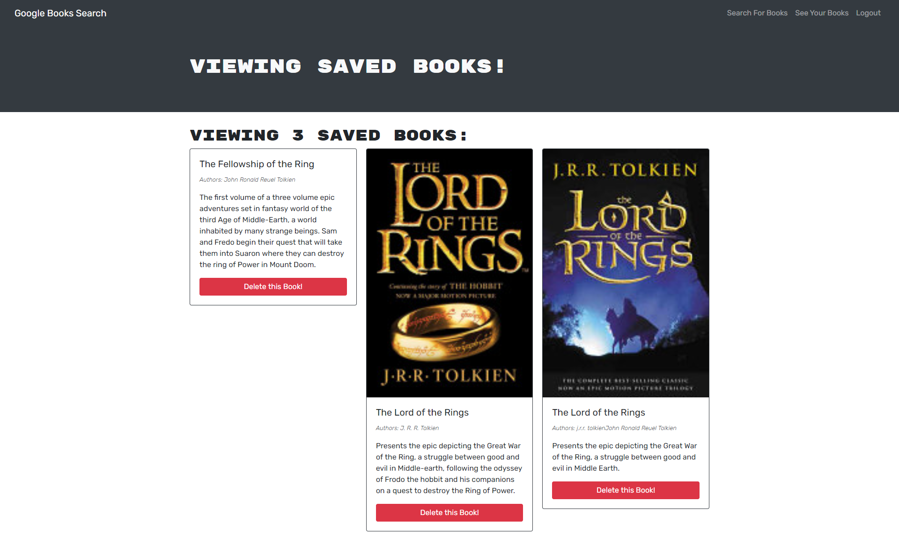

[](https://opensource.org/licenses/MIT)
# MERN Google Books Search Engine

## Description
An application where users can create accounts, search for books through the GoogleBooksAPI, and add them to a list of saved books

## Table of Contents
- [MERN Google Books Search Engine](#mern-google-books-search-engine)
  - [Description](#description)
  - [Table of Contents](#table-of-contents)
  - [Installation](#installation)
  - [Built With](#built-with)
  - [Website](#website)
  - [Screenshot](#screenshot)
  - [Contributing](#contributing)
  - [Questions](#questions)
  - [License](#license)
## Installation
In order to install please enter the following code:
```
npm i
```
## Built With
* JavaScript
* Bootstrap
* Node
* React
* GraphQL
* Apollo


## Website
https://floating-sea-30875.herokuapp.com/

## Screenshot


## Contributing
If you are looking to contribute you can for example: 
* Submit bugs and feature requests


## Questions
If you have any questions or comments you can reach out to me directly at: danny.ramirezgd@gmail.com or [dannyramirezgd](https://github.com/dannyramirezgd)
  
## License
Copyright (c) dannyramirezgd

This license made with MIT

